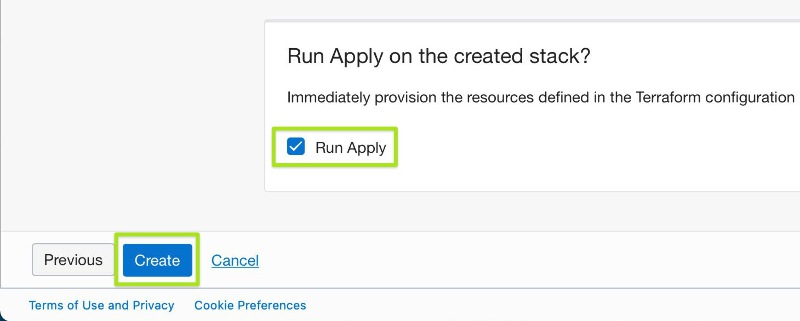
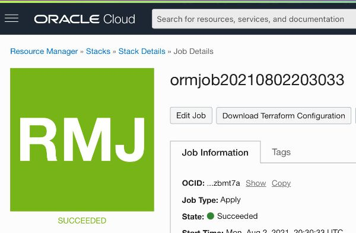
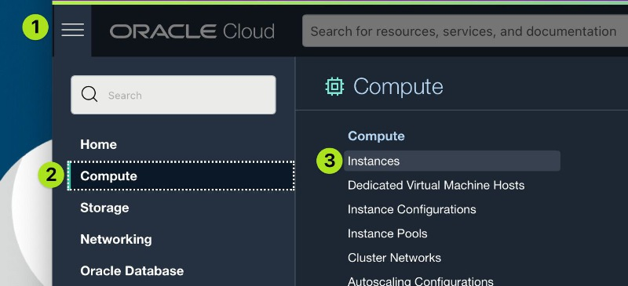
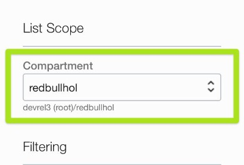
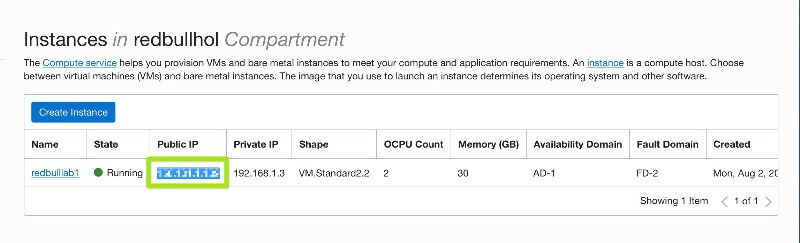
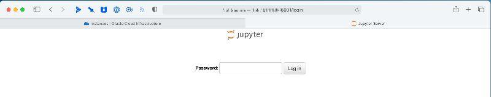

# Beginners Hands-On Lab

## Prerequisites

You'll need an OCI free trial account ([click here to sign up](https://signup.cloud.oracle.com/?sourceType=_ref_coc-asset-opcSignIn&language=en_US)). We're going to use a ready-to-go image to install the required resources, so all you need to start is a free account.

Registered lab participants should have received $500 in credits to use for Data Science operations.

## Getting Started

1. Click the button below to begin the deploy of the Data Science stack and custom image:

    
2. If needed, log into your account. You should then be presented with the **Create Stack** page. Under *Stack Information* (the first screen), check the box *I have reviewed and accept the Oracle Terms of Use*. Once that box is checked, the information for the stack will be populated automatically.
    
    
3. Click **Next** at the bottom of the screen. This will take you to the **Configure Variables** page. Nothing needs to be changed here, just click **Next** again.
4. On the **Review** page, be sure *Run Apply* is checked, and click **Create**.

    
5. This will take you to the **Job Details** page, and OCI will begin creating the stack and deploying the custom image for the lab. This will take about 11 minutes. When it completes (assuming everything went smoothly), the **Job Details** will show a bright green square with "Succeeded" below it.
    
    
6. Once the Create Stack job has succeeded, click the hamburger menu in the upper left, select **Compute** in the sidebar, and click **Instances** in the menu.

    
7. On the **Instances** screen, make sure "redbullhol" is selected under *Compartment*. If "redbullhol" isn't in the dropdown menu, it may need some time to show up, so grab (another) cup of coffee/tea and check back in a few minutes.

    
8. Once the "redbullhol" compartment is selected, you should see a running Instance in the list. The address you'll need to access it is in the *Public IP* column. Copy the IP address shown.

    
9. Open a new tab in your browser and paste the IP address with `:8001` added to the end. The URL should look like `http://xxx.xxx.xxx.xxx:8001` (substituting your public IP). Jupyter Lab is running on port 8001, so when you navigate to this URL you should see the Juypter login.

    
10. Log in with the password `Redbull1`.
11. You should now see the Jupyter Lab. Navigate in the sidebar to `/redbull-analytics-hol/beginners/` to see the Jupyter notebooks for this lab.

The notebooks are numbered and you'll progress through them in order. These will walk you through collecting and analyzing the data we'll use to predict some races.

## Using the Jupyter Lab

The Jupyter notebooks are ordered by number, and you'll progress through them in sequence. 

All of the data and models for this lab are already stored in this directory. You can run the notebooks to see what they do, but it's not required to see the finished product. Note that running the notebook `04.ML_Modelling` takes about 40 minutes, so if you want to play with it, save it until after the live lab.

These notebooks use data gathered from ergast.com. The data gathering process takes some time, so we've gone ahead and pulled the data in for you. However, if you want to see how it's done, take a look in the `from_scratch` directory, where you'll find the original scripts that gathered the remote data.

See the notes in each notebook for a bit of explanation as you go. If you have a basic understanding of Python, you should also be able to see the nitty gritty of what's happening.

## Developer Journey Map

View each notebook in numeric order:

- 01_0.Formule1_Data_Collection.ipynb
- 01_1.Weather_Data_Collection.ipynb
- 01_2.Qualifying_Data_Collection.ipynb
- 02.Data_Preparation_merging.ipynb
- 03.f1_analysis_EDA.ipynb
- 04.ML_Modelling.ipynb
- 05.ML_Model_Serving.ipynb

## Starting The Web Application

To see the results of the lab, you'll need to start the web server using Terminal.

1. In the menu at the top of the page, select **File->New->Terminal**.
2. Enter the following commands, hitting return after each one (feel free to copy and paste)

        cd /home/opc/redbull-analytics-hol/beginners/web
        source /home/opc/redbullenv/bin/activate
        python3 app.py
3. Open a web browser to the public IP of your Jupyter Lab, but use port 8080 instead of port 8001:

        http://xxx.xxx.xxx.xxx:8080
