# Beginners Hands-On Lab

## Prerequisites

You'll need an OCI free trial account (<a href="https://signup.cloud.oracle.com/?sourceType=_ref_coc-asset-opcSignIn&language=en_US" target="_blank" title="Sign up for free trial">click here to sign up</a>). We're going to use a ready-to-go image to install the required resources, so all you need to start is a free account.

Registered lab participants should have received $300 in credits to use for Data Science operations.

### SSH Key

You'll also need an SSH key pair to access the OCI Stack we're going to create. For Mac/Linux systems, you can [use `ssh-keygen`](https://docs.oracle.com/en-us/iaas/Content/Compute/Tasks/managingkeypairs.htm#ariaid-title4). On Windows, you'll [use PuTTY Key Generator](https://docs.oracle.com/en-us/iaas/Content/Compute/Tasks/managingkeypairs.htm#ariaid-title5). 

To summarize Mac/Linux:

    ssh-keygen -t rsa -N "" -b 2048 -C "<key_name>" -f <path/root_name> 

For Windows, and step-by-step instructions for Mac/Linux, please see the [Oracle Docs on Managing Key Pairs](https://docs.oracle.com/en-us/iaas/Content/Compute/Tasks/managingkeypairs.htm#Managing_Key_Pairs_on_Linux_Instances).

## Getting Started

1. Click the button below to begin the deploy of the Data Science stack and custom image:
    
    <a href="https://cloud.oracle.com/resourcemanager/stacks/create?region=home&zipUrl=https://github.com/oracle-devrel/redbull-analytics-hol/releases/latest/download/redbull-analytics-hol-latest.zip" target="_blank"></a>
2. If needed, log into your account. You should then be presented with the **Create Stack** page. 
    
    These next few steps will deploy a stack to your OCI tenancy. This will include a Compute instance and the necessary tools to deploy and run Jupyter Lab from within your OCI account.

    Under *Stack Information* (the first screen), check the box *I have reviewed and accept the Oracle Terms of Use*. Once that box is checked, the information for the stack will be populated automatically.
    
    
3. Click **Next** at the bottom of the screen. This will take you to the **Configure Variables** page. On this page you'll need to provide the SSH key we created in the prerequisites. If you want your Compute instance to function after your Free Trial ends, check the box for an Always Free Shape. Then click **Next** again.

    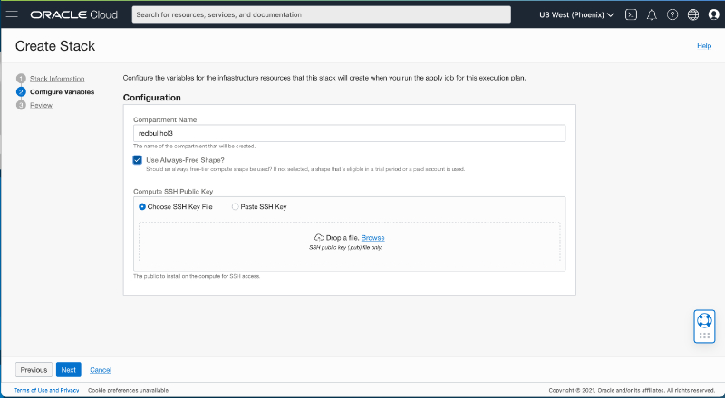
4. On the **Review** page, be sure *Run Apply* is checked, and click **Create**.

    
5. This will take you to the **Job Details** page, and OCI will begin creating the stack and deploying the custom image for the lab. This will take about 11 minutes. When it completes (assuming everything went smoothly), the **Job Details** will show a bright green square with "Succeeded" below it.
    
    
6. Once the Create Stack job has succeeded, click the hamburger menu in the upper left, select **Compute** in the sidebar, and click **Instances** in the menu.

    
7. On the **Instances** screen, make sure "redbullhol" is selected under *Compartment*. If "redbullhol" isn't in the dropdown menu, it may need some time to show up, so grab (another) cup of coffee/tea and check back in a few minutes.

    
8. Once the "redbullhol" compartment is selected, you should see a running Instance in the list. The address you'll need to access it is in the *Public IP* column. Copy the IP address shown.

    
9. Next, open a new tab in your browser to load up the web UI for Jupyter Lab. Paste the IP address you just copied with `:8888` added to the end. The URL should look like `https://xxx.xxx.xxx.xxx:8888` (substituting the public IP we copied in the previous step). Jupyter Lab is running on port 8888, so when you navigate to this URL you should see the Juypter login.

    _**Note:** You should not be on VPN when opening Jupyter Lab._

    
10. Retrieve the token to log in to the JupyterLab. For that, Open the PuTTY utility from the Windows start menu.

    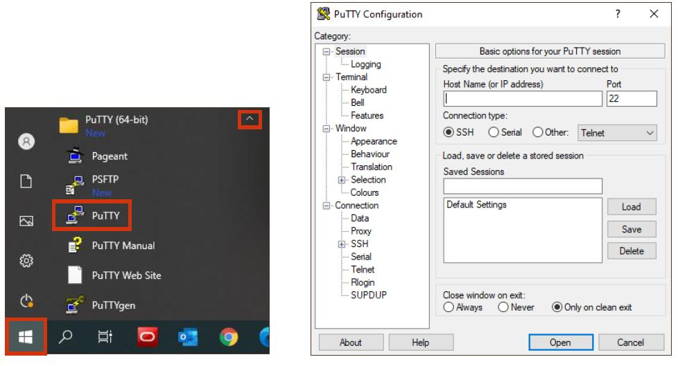
11. In the **Host Name** (or IP address) dialog box, enter the Public IP address of your OCI Compute Instance. The Public IP of your instance should have been pasted in your text file.

    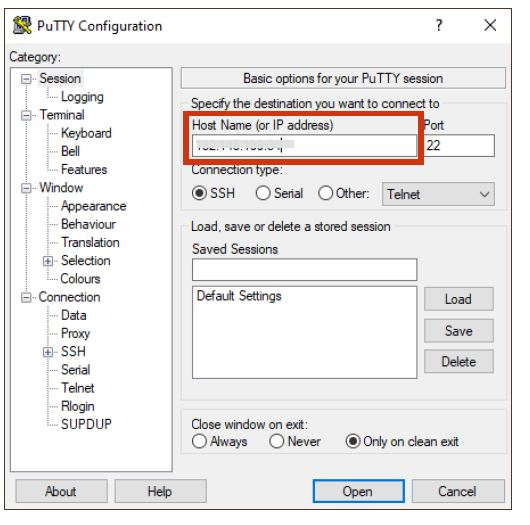
12. Under **Category**, expand **Connection** and then select the **Data** field. Enter **opc**. OCI instances will default to the username **opc** if they have Oracle Linux's Operating System installed.

    
13. Under **Connection**, expand **SSH** and select the **Auth** category.

    
14. Click on the **Browse** button and locate the private key file you created in the earlier step. Once selected, click **Open**.

    
15. Now, click the **Open** button in PuTTY to initiate the SSH connection to your cloud instance.

    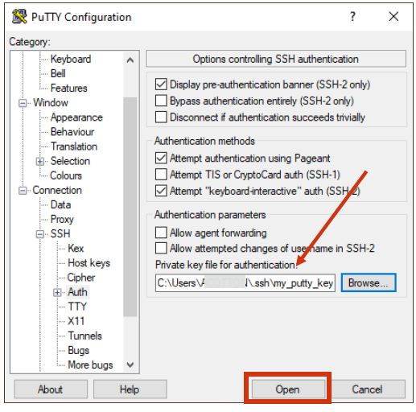
16. Click **Accept** to bypass the Security Alert about the uncached key.

    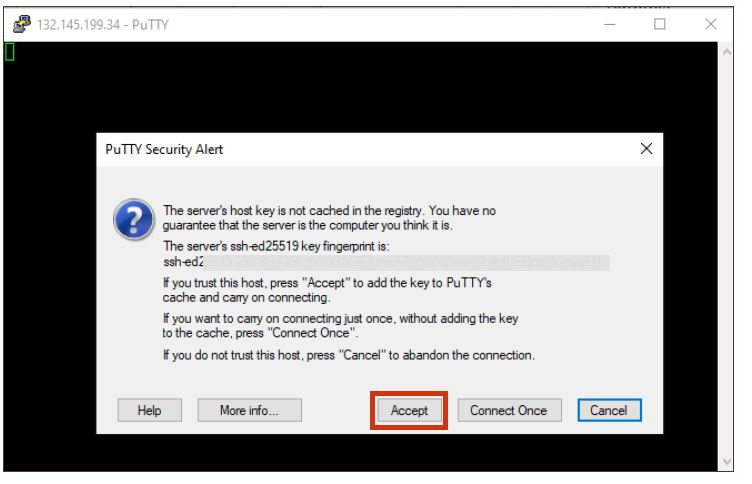
17. Connection successful. You are now securely connected to your OCI Cloud instance.

    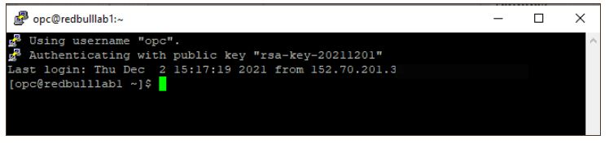
18. Enter the following command: ```pwd```

    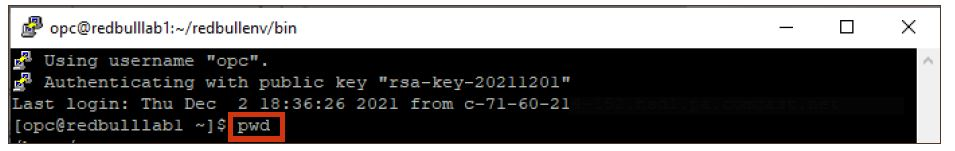
19. Enter the following command: ```cd ./redbullenv/bin```

    
20. Enter the following command: ```./jupyter server list```

    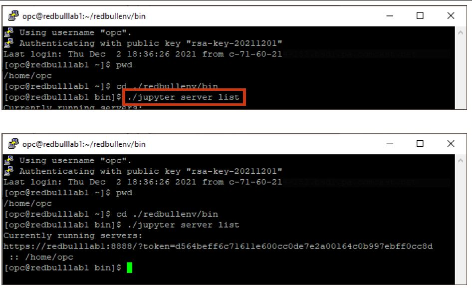
21. Once executed, **copy the token string** (token string appears within "**token=**" and "**:: /home/opc**") and **paste** it into your text file. We will need this token string to enter into the Jupyter notebook login screen.

    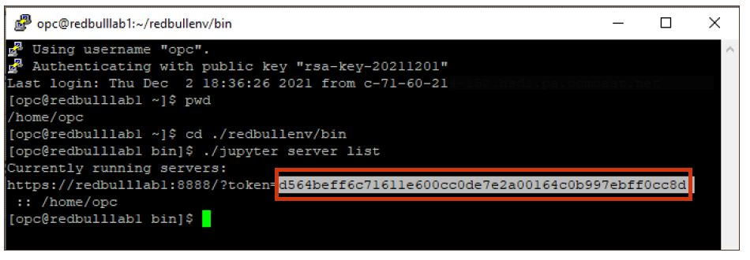
22. **Close** the PuTTY utility process.

    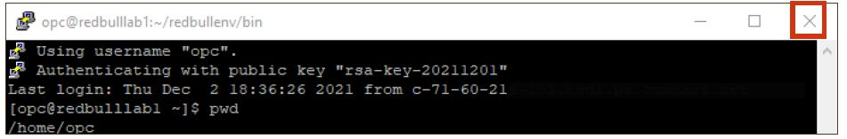
23. Next, open a new tab in your browser to load up the web UI for JupyterLab. Paste the **jupyter_url** you copied to your text file. The URL resembles **https://xxx.xxx.xx.xx:8888** (substituting the Public IP of your instance). JupyterLab is running on port 8888, so when you navigate to this URL you should see the Jupyter login.

    _**Note:** it is recommended to be off any VPN when opening JupyterLab._

    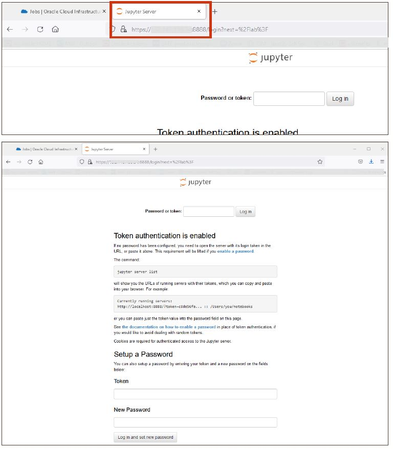
24. We can now use the token string to enter into the Jupyter notebook login screen. We can also set a password for the notebook so that in the future, we can use the password rather than a token authentication. Under the **"Setup a Password"** section, **paste** in the **token string** from your text file. Set the **New Password** to anything you want, like **Redbull1**. Then click **Log in and set new password**. 

    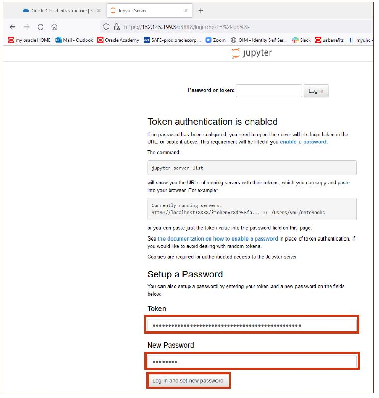
25. You should now see the Jupyter Lab. Navigate in the sidebar to `/redbull-analytics-hol/beginners/` to see the Jupyter notebooks for this lab.

The notebooks are numbered and you'll progress through them in order. These will walk you through collecting and analyzing the data we'll use to predict some races.


## Using the Jupyter Lab

The Jupyter notebooks are ordered by number, and you'll progress through them in sequence. 

All of the data and models for this lab are already stored in this directory. You can run the notebooks to see what they do, but it's not required to see the finished product. Note that running the notebook `04.ML_Modelling` takes about 40 minutes, so if you want to play with it, save it until after the live lab.

These notebooks use data gathered from ergast.com. The data gathering process takes some time, so we've gone ahead and pulled the data in for you. However, if you want to see how it's done, take a look in the `from_scratch` directory, where you'll find the original scripts that gathered the remote data.

See the notes in each notebook for a bit of explanation as you go. If you have a basic understanding of Python, you should also be able to see the nitty gritty of what's happening.

## Developer Journey Map

View each notebook in numeric order:

- 01_0.Formule1_Data_Collection.ipynb
- 01_1.Weather_Data_Collection.ipynb
- 01_2.Qualifying_Data_Collection.ipynb
- 02.Data_Preparation_merging.ipynb
- 03.f1_analysis_EDA.ipynb
- 04.ML_Modelling.ipynb
- 05.ML_Model_Serving.ipynb

## Starting The Web Application

To see the results of the lab, you'll need to start the web server using Terminal.

1. In the menu at the top of the page, select **File->New->Terminal**.
2. Enter the following commands, hitting return after each one (feel free to copy and paste)

        cd /home/opc/redbull-analytics-hol/beginners/web
        source /home/opc/redbullenv/bin/activate
        python3 app.py
3. Open a web browser to the public IP of your Jupyter Lab, but use port 8443 instead of port 8888:

        https://xxx.xxx.xxx.xxx:8443

    The Public IP is the one at which you're currently accessing Jupyter Lab, which we copied from the Running Instances step above.